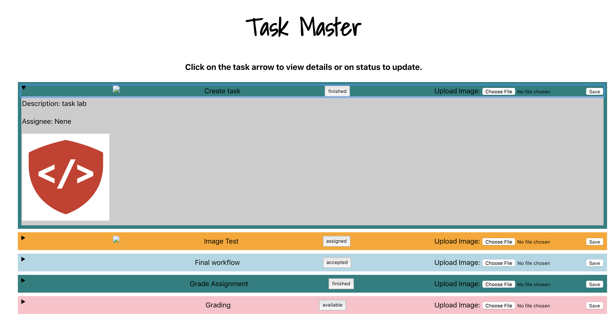

This project was bootstrapped with [Create React App](https://github.com/facebook/create-react-app).

## Task Master
This is an application that displays all available tasks. The user can click on the arrow to view more information about a specific task. The details include the description and the assignee. The status is also displayed, in which, the user can click to update from available -> assigned -> accepted -> finished. The user can also upload an image to the corresponding task using the upload button.

### Interface

### Links
* [Front-end](https://master.d1ouueqql1w4yj.amplifyapp.com/)
* [Back-end](http://taskmasterapp.us-east-2.elasticbeanstalk.com/tasks)
